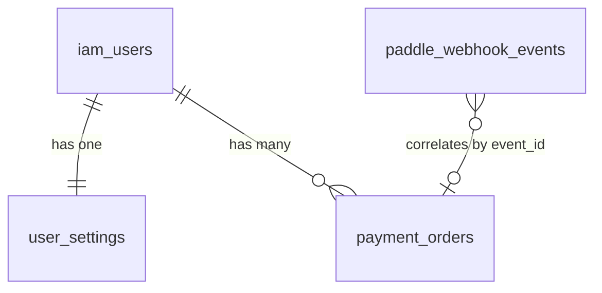

# EnerQuote 反向 PRD（基于现有代码）

> 文档目的：依据当前仓库实现反推产品需求与后端数据模型，作为后续重构、测试补齐、需求评审的基线。  
> 代码范围：`backend/app/*`、`frontend/lib/*`、`PROJECT_SNAPSHOT.md`。  
> 版本口径：当前主干实现（含 OAuth、Paddle、RevenueCat、设置与账号删除链路）。

---

## 1. 产品定位

EnerQuote 是面向光伏+储能集成商的报价与收益测算 SaaS，提供：

- 8760 小时物理仿真（发电、充放电、削峰、停电影响）
- 财务回报测算（现金流、NPV、IRR、回本周期）
- 基于订阅权益的功能分层（FREE/PRO）
- 报价展示与建议书导出（前端 PDF 流程）

核心价值是将“参数调优 -> 仿真测算 -> 财务回报 -> 商务输出”串成闭环，并通过订阅付费完成商业化。

---

## 2. 目标用户与角色

### 2.1 目标用户

- 光储项目销售、方案经理、渠道伙伴
- 需要快速给客户输出 ROI 与报价建议的 B2B 团队

### 2.2 角色模型（当前实现）

Firebase ID Token 校验后，后端派生以下会话字段：

- `sub`：用户 ID
- `company_id`：当前为 `"solo-tenant"`（MVP 单租户口径）
- `role`：当前固定 `"SALES"`
- `tier`：`FREE` / `PRO`（根据到期时间动态纠偏）

> 注：代码中虽然存在 `Company/Project/HardwarePricing` 多租户草案模型，但当前主业务链路使用 `iam_users + user_settings + payment_orders`。

---

## 3. 产品范围（当前已实现）

### 3.1 账号与认证

- 邮箱密码登录
- 邮箱 OTP 注册（发码 + 验码 + 注册）
- 忘记密码（邮箱验证码重置）
- Firebase Auth Google 登录
- Firebase Auth Microsoft 登录
- 账号删除（App 内 + 网页 OTP 门户）

### 3.2 测算引擎

- 仿真接口：`POST /api/v1/simulate`
- 输入：环境/负荷、PV 参数、ESS 参数、电价策略、财务参数
- 逻辑：
  - 有经纬度时调用 PVGIS 拉取真实辐照
  - 物理引擎计算 8760 小时能量流
  - 财务引擎计算 NPV/IRR/回本/现金流
- 输出：物理 KPI + 小时级结果 + 财务报表

### 3.3 订阅与支付

- Web：Paddle 创建交易 + Webhook 验签处理
- Android：RevenueCat 购买与 webhook 对账
- 支付事件落库、按 `event_id` 幂等去重
- 支持 `BILLING_ISSUE` 宽限期逻辑（保持 PRO 若在 grace window 内）

### 3.4 设置与权益控制

- 拉取个人设置（`GET /settings/me`）
- 更新个人设置（`PUT /settings/me`）
- PRO 才能修改成本参数：
  - `pv_cost_per_kw`
  - `ess_cost_per_kwh`
  - `margin_pct`
- 品牌字段（公司名/Logo）与订阅状态同屏展示

### 3.5 地理配置

- 城市列表由 `cities.json` 动态下发（`GET /locations/cities`）
- 城市支持 `is_pro_only`，前端根据 tier 阻断选择

---

## 4. 业务流程（反推）

### 4.1 注册登录流程

1. 用户输入邮箱+密码请求 OTP  
2. 后端写入 Redis OTP（5 分钟）并发邮件  
3. 用户提交 OTP 完成注册并获得 JWT  
4. 前端缓存 token 与 tier，进入 Dashboard

### 4.2 登录与会话流程

1. 用户通过 Firebase（邮箱/Google/Microsoft）完成登录  
2. 前端携带 Firebase ID Token 调用 `/auth/firebase` 完成账号同步  
3. 前端请求时统一注入 Bearer Token  
4. 401（非 auth 接口）触发全局登出

### 4.3 测算流程

1. Dashboard 采集参数（容量、负荷、城市坐标、成本）  
2. 后端校验鉴权，执行仿真与财务计算  
3. 返回 KPI（总发电、IRR、回本、现金流）  
4. 前端绘图并支持导出提案

### 4.4 升级 PRO 流程

- Web（Paddle）：
  1. 调 `/payment/checkout` 获取托管结账链接
  2. 用户完成支付，Paddle webhook 回调
  3. 后端验签、落库、将用户升级为 PRO（默认+30天）
  4. 前端轮询 `/settings/me` 同步最新 tier

- Android（RevenueCat）：
  1. App 侧完成订阅购买
  2. RevenueCat webhook 回调后端
  3. 后端按事件更新 tier 与到期时间
  4. 前端读取 refresh/settings 状态更新 UI

### 4.5 账号删除流程

- App 内删除：`DELETE /auth/logout`，删除用户并解绑关联记录
- 网页删除：
  1. 输入邮箱发 OTP
  2. 校验 OTP + 强确认
  3. 删除用户配置、解绑支付记录、删除账号

---

## 5. 功能需求清单（PRD 口径）

### 5.1 认证与账号

- 支持邮箱密码登录，失败提示清晰（邮箱格式/账号密码错误）
- 支持 Google / Microsoft 登录并绑定 provider_id
- 本地账号与第三方登录冲突时返回 409（防串号）
- 支持 forgot/reset password，验证码有效期 15 分钟
- 支持注册 OTP，验证码 6 位，5 分钟有效

### 5.2 权限与订阅

- 系统区分 `FREE`、`PRO`
- PRO 权益随到期时间动态失效（过期回落 FREE）
- 支付事件必须幂等，避免重复提权
- `BILLING_ISSUE` 支持 3 天宽限保级
- 设置接口对成本参数进行服务端强鉴权（FREE 不可写）

### 5.3 测算与报价

- 支持 8760 小时负荷/辐照输入
- 坐标有效时自动抓取 PVGIS 真实气象
- 输出必须包含：
  - 物理 KPI（发电量、自发自用率、自给率、循环次数）
  - 小时级功率流向
  - 财务结果（NPV/IRR/回本/现金流）

### 5.4 前端体验

- 登录页竖屏，业务页横屏
- 401 全局拦截，自动回登录页
- 支持多语言（zh/en/es/pt）
- 支持设置页展示账号邮箱、tier、到期时间
- 支持付费墙与升级入口（Dashboard + Settings 双入口）

### 5.5 合规与法务

- 提供 `privacy` / `terms` 静态页面
- 提供账号删除入口与 OTP 二次确认

---

## 6. 非功能与技术约束（代码反推）

- 鉴权：Firebase ID Token 服务端校验
- 可观测性：关键链路含日志（支付、webhook、外部 API）
- 安全：
  - Paddle webhook 必须签名验证
  - RevenueCat webhook 可配置 Authorization 校验
  - 密码哈希存储（bcrypt）
- 容错：
  - 注册/重置密码尽量防枚举（部分接口返回模糊成功）
  - 城市配置文件缺失时提供兜底城市

---

## 7. 接口总览（当前可见）

### 7.1 认证

- `POST /api/v1/auth/firebase`
- `POST /api/v1/auth/send-otp`
- `POST /api/v1/auth/verify-otp-and-register`
- `POST /api/v1/auth/forgot-password`
- `POST /api/v1/auth/reset-password`
- `DELETE|POST /api/v1/auth/logout`

### 7.2 测算与配置

- `POST /api/v1/simulate`
- `GET /api/v1/locations/cities`
- `GET /api/v1/settings/me`
- `PUT /api/v1/settings/me`

### 7.3 支付

- `POST /api/v1/payment/checkout`
- `POST /api/v1/payment/webhook` (Paddle)
- `POST /api/v1/payment/webhook/revenuecat`
- `GET /api/v1/payment/checkout-ui`
- 兼容入口：`POST /webhook/revenuecat`

### 7.4 法务/门户

- `GET /privacy` / `GET /terms`
- `GET /account-deletion`
- `POST /account-deletion/send-code`
- `POST /account-deletion/confirm`

---

## 8. 后端数据库模型（真实生效模型）

> 说明：以下为当前主链路实际使用模型。  
> 数据库连接配置为 PostgreSQL（`postgresql+psycopg2`），但历史文档存在 SQLite 表述，属于文档与实现不一致。

### 8.1 `iam_users`（用户主表）

用途：账号身份、登录方式、订阅状态。

主要字段：

- `id` (PK, string uuid)
- `email` (unique, indexed, not null)
- `hashed_password` (nullable，OAuth 用户可为空)
- `auth_provider` (`local/google/microsoft/...`)
- `provider_id` (unique, indexed, nullable)
- `tier` (`FREE/PRO/...`)
- `pro_expire_date` (datetime, nullable)
- `reset_code` (6位码, nullable)
- `reset_code_expire` (datetime, nullable)
- `is_active` (bool)
- `created_at` (datetime)

关键约束/规则：

- `email` 唯一
- `provider_id` 唯一
- 登录时按 `tier + pro_expire_date` 计算 effective_tier

### 8.2 `user_settings`（用户配置表）

用途：品牌配置、成本与利润参数（报价口径）。

主要字段：

- `user_id` (PK, FK -> `iam_users.id`)
- `company_name`
- `logo_url`
- `pv_cost_per_kw`
- `ess_cost_per_kwh`
- `margin_pct`

关键规则：

- 一对一（主键即外键）
- FREE 禁止更新成本参数（后端 403）

### 8.3 `payment_orders`（支付事件/订单流水）

用途：支付审计、提权证据、账务幂等。

主要字段：

- `id` (PK)
- `user_id` (FK -> `iam_users.id`, nullable，删除账号后可置空)
- `event_id` (unique, indexed, nullable)
- `event_type` (indexed)
- `status` (indexed, 如 `PAID/BILLING_ISSUE/CANCELED/EXPIRED`)
- `transaction_id` (indexed)
- `subscription_id` (indexed)
- `customer_id` (indexed)
- `customer_email` (indexed)
- `currency_code`
- `amount`
- `occurred_at`
- `raw_data` (JSON)
- `created_at`

关键规则：

- 以 `event_id` 去重，保障 webhook 幂等
- 账号删除时 `user_id` 置空，保留审计流水

### 8.4 `paddle_webhook_events`（Paddle webhook 审计表）

用途：webhook 接收与验签审计、问题追踪。

主要字段：

- `id` (PK)
- `event_id` (indexed)
- `event_type` (indexed)
- `process_status` (indexed: received/processed/invalid_signature/ignored...)
- `signature_valid` (bool)
- `signature_header`
- `request_headers` (JSON)
- `request_query` (JSON)
- `request_path`
- `raw_body` (text)
- `error_message` (text)
- `created_at`

关键规则：

- 所有 webhook 先落审计，再执行业务处理
- 验签失败写审计并返回 400

---

## 9. 数据关系图（当前主链路）

---

## 10. 历史/候选模型（当前未接入主流程）

文件 `backend/app/db/models.py` 中存在以下模型定义：

- `companies`
- `users`
- `hardware_pricing`
- `projects`

这些模型体现了“多租户企业报价系统”的演进方向，但当前 API 主链路未直接使用（现阶段核心走 `iam_users` 体系）。

---

## 11. 状态机（订阅权益）

### 11.1 用户 tier 状态

- 初始：`FREE`
- 升级：
  - Paddle `transaction.completed` / `subscription.renewed` -> `PRO`
  - RevenueCat `INITIAL_PURCHASE` / `RENEWAL` -> `PRO`
- 维持：
  - RevenueCat `BILLING_ISSUE` -> 保持 `PRO` + 延长 grace
- 降级：
  - Paddle `subscription.canceled/past_due` -> `FREE`
  - RevenueCat `CANCELLATION/EXPIRATION` -> `FREE`
  - 登录/刷新/设置时若已过期 -> `FREE`

---

## 12. 关键风险与改进建议（基于现状）

- 数据模型并存：`iam_users` 与历史 `users` 双体系，建议尽快统一
- DB 文档口径已统一：项目文档已更新为 PostgreSQL（历史 SQLite 表述已废弃）
- 订阅模型仍偏简化：建议升级到 `status + renew_at + cancel_at_period_end`
- 测算参数落库不足：当前侧重在线计算，缺少“项目级历史报价”持久化
- 文案/i18n 尚有硬编码英文，建议继续收敛到语言包

---

## 13. 验收口径（用于后续 PRD 实施核对）

- 能完成 Firebase 登录（Google/Microsoft/邮箱）、注册 OTP、忘记密码
- FREE 用户不可写成本参数，PRO 可写且可在 Dashboard 生效
- 支付完成后可在短时间内从 FREE 升级至 PRO（含 refresh）
- webhook 重放不会重复入账（`event_id` 幂等）
- 账号删除后用户不可再登录，配置清除，支付流水保留且解绑

